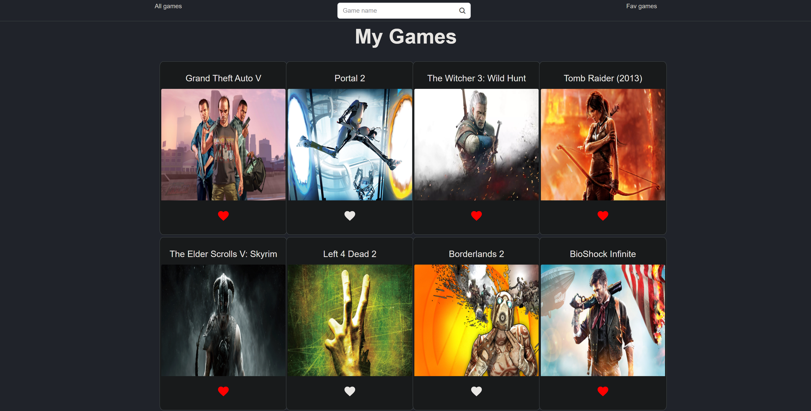

# My_Games
### A video games library
A video game website that allow you to add, remove, edit
and clear games and Mark it as complete/favorite and many more

 

## [Wireframe](https://wireframe.cc/ftRU01)
 

## Getting Started
To run this project on your local machine, fork and clone the repo from github.  
Install all dependencies by running `npm i` in the project directory terminal.  
Run `npm start` to start your frontend. 
  

  

   
# Use

Either download the project or [Use it online](https://pages.git.generalassemb.ly/faisalabdulaziz/My-Games/)
   

# Features
- [x] All components are functional, not class based and use arrowhead syntax
- [x] listing Games from game api
- [x] searching Games by title
- [x] add games to your favorite list
- [x] manage your favorite list
   

## Searching 
type the title of the Game in search bar
  

## Favorite List
Press the `<3` button on the game to keep it into favorite list.\
You can checkout the favorite list by clicking on the fav games bar\
press `x` to remove it from favorite list
  

## Game Details
Click on the game to see more info
   

# Future Updates

- [x] tablet browsers support
- [ ] phone browsers support
- [ ] Adding already played tab
- [ ] Adding the ability to add comments on games that already have been played
- [ ] Adding the ability to Drag and Drop
- [ ] Adding more animations
- [ ] Adding more Styling
   

# Technologies used 

- HTML
- CSS
- js
- React
- Axios
- Node
- npm
- React-bootstrap
- Rsuitejs
- React-icons
 

## Run the game Requirement:

All application components are usable across modern desktop, tablet only, phone browsers will be supported soon.
 

## API REFERENCE
 API | Method | Router | URL
-----|--------|--------|-----
rawg| GET    | /games  | https://api.rawg.io/api/games
